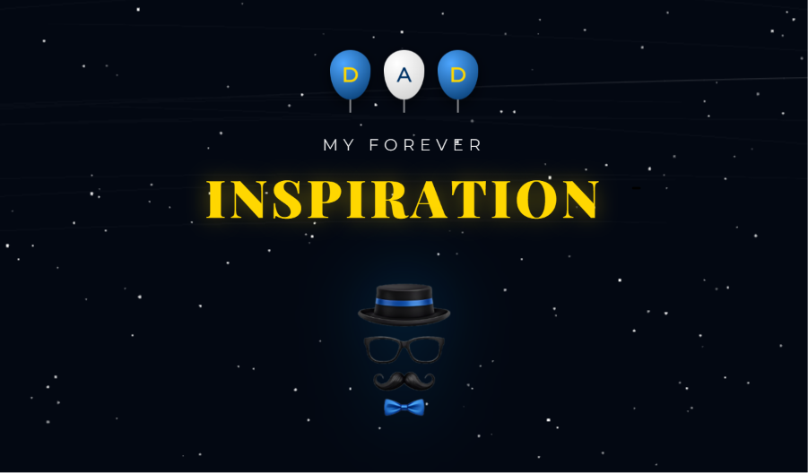

# 👔 Cartão de Dia dos Pais - "My Forever Inspiration"

Bem-vindo ao código do projeto do Cartão de Dia dos Pais! 👔 Este é um projeto de Codificação Criativa desenhado para ser uma homenagem digital elegante e emocionante, com foco em tipografia sofisticada e animações de partículas.

## 🚀 Sobre o Projeto

Uma experiência interativa construída do zero, combinando manipulação de elementos HTML e estilização CSS avançada com um sistema dinâmico de partículas no Canvas[cite: 7, 8, 9]. O projeto se destaca pela introdução dramática do texto via JavaScript e pela interatividade dos fogos de artifício no clique do usuário[cite: 8].

## ✨ Funcionalidades Principais

* **Fundo Estelar (Canvas):** Um sistema autônomo gerando estrelas de fundo com opacidade variável e estrelas cadentes que cruzam a tela suavemente[cite: 8].
* **Fogos de Artifício Interativos:** Ao clicar com o mouse ou tocar na tela, sequências de fogos de artifício nas cores azul, dourado e branco são disparadas em direção ao topo e explodem fisicamente[cite: 8].
* **Balões Flutuantes temáticos:** Elementos que soletram "D A D", estilizados com gradientes prateados e azuis profundos, flutuando em loop contínuo no CSS[cite: 7, 9].
* **Animação de Digitação (Typing Effect):** O texto "MY FOREVER INSPIRATION" é revelado progressivamente, letra por letra, com fade-in e movimentação no eixo Y, tudo controlado por JavaScript nativo[cite: 8].
* **Design e Glow:** Uso de tipografia elegante (`Montserrat` e `Playfair Display`), sombreamento dourado (`text-shadow`) nas letras e uma animação contínua de pulsação de escala na imagem central[cite: 7, 9].
* **Cursor Personalizado:** O cursor padrão do mouse é substituído por um emoji de gravata (👔) para combinar com o tema[cite: 9].

## 🛠️ Tecnologias Utilizadas

* **HTML5:** Estruturação semântica do conteúdo e contêineres[cite: 7].
* **CSS3:** Animações via `@keyframes` (`float`, `pulse`), sombreamentos avançados (`drop-shadow`, `box-shadow`) e centralização com Flexbox[cite: 9].
* **JavaScript puro:** Lógica do efeito de digitação atrasada (delay/timeout) e controle de física complexa no `<canvas>` (gravidade, fricção e decaimento das partículas das explosões)[cite: 8].

## 📂 Estrutura de Arquivos

* `index.html` - A estrutura principal da página.
* `style.css` - Contém todas as regras visuais, fontes e animações CSS.
* `script.js` - O motor de interatividade, partículas e texto animado.
* `pai.PNG` (ou `Icon.png`) - A imagem do kit de pai (chapéu, óculos, bigode) referenciada no projeto.
* `dad.png` - Imagem de demonstração (preview) deste README.

## 🚀 Como Executar

1. Faça o download ou clone este repositório.
2. Certifique-se de que o arquivo da imagem (`pai.PNG`) esteja na mesma pasta dos arquivos de código, conforme apontado no HTML.
3. Dê um duplo clique no arquivo `index.html` para abri-lo em qualquer navegador web moderno.
4. Aguarde a mensagem aparecer e clique na tela para soltar os fogos de artifício!
