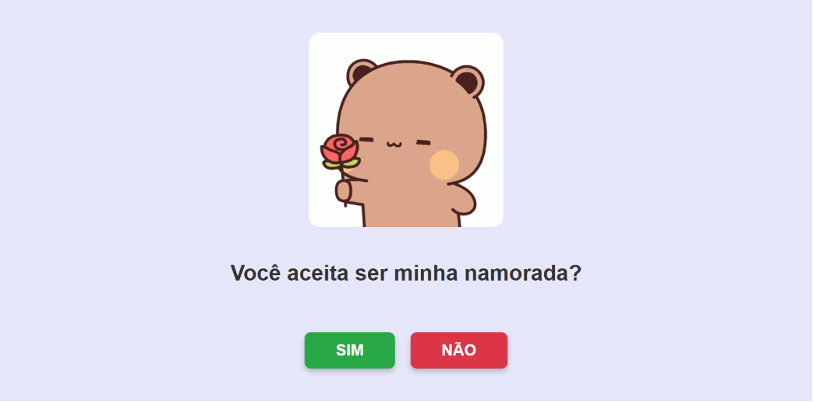

# 🐻❤️ Pedido de Namoro Irrecusável (Botão Fugitivo)

Bem-vindo ao repositório do **Pedido de Namoro Irrecusável**! 🎉 
Esse é o código do cartão virtual interativo que bateu milhares de visualizações no Instagram. Ele possui um botão "NÃO" inteligente que foge do mouse, garantindo que o seu amor só tenha uma opção: dizer **SIM!**

---

## ✨ Demonstração

---

## 🚀 Funcionalidades

* **Botão Fugitivo:** Uma lógica matemática em JavaScript faz o botão vermelho "NÃO" escapar do cursor ou do toque na tela, mudando sua posição de forma aleatória.
* **Textos Dinâmicos:** Mensagens divertidas (como "Tem certeza?", "Pense bem..." e "Olha lá, hein!") aparecem a cada tentativa frustrada de clicar no "NÃO".
* **Chuva de Confetes e Corações:** Uma animação linda, colorida e romântica é disparada na tela de sucesso ao clicar em "SIM".
* **Responsivo:** Funciona perfeitamente tanto em computadores (com o evento de mouse) quanto em telas de celulares (com o evento de toque).

---

## 🛠️ Como usar e personalizar

Você pode facilmente clonar este projeto e alterá-lo para enviar para a sua própria pessoa amada! Siga os passos:

1. **Faça o Download**
   Faça o download ou clone este repositório para o seu computador.

2. **Troque os GIFs**
   O projeto usa duas imagens principais: `urso.gif` (tela inicial) e `urso2.gif` (tela de sucesso). Você pode baixar os seus próprios GIFs fofos, salvá-los na mesma pasta com esses exatos nomes, ou alterar os nomes diretamente no arquivo `index.html`.

3. **Altere os Textos**
   Abra o arquivo `index.html` e o `script.js` em qualquer editor de código (como o VSCode) e mude as frases para algo que tenha a cara do seu relacionamento.

4. **Hospede de Graça (Opcional)**
   Para enviar como um link do WhatsApp, você pode subir a pasta do projeto em sites gratuitos como o [GitHub Pages](https://pages.github.com/), [Netlify Drop](https://app.netlify.com/drop) ou [Vercel](https://vercel.com/).

---

## 📂 Estrutura de Arquivos

* `index.html` - Estrutura principal do cartão, onde ficam os textos e a importação das imagens.
* `style.css` - Todo o visual do projeto: cores em tom pastel, estilização dos botões, fontes e a animação dos confetes caindo.
* `script.js` - Onde a mágica acontece: a lógica de fuga do botão, a troca das frases e o gerador de corações na tela de sucesso.

---

Feito com muito amor e um pouquinho de zoeira 💖. Se você usar esse código e conseguir um "SIM", me conta lá no Instagram!
